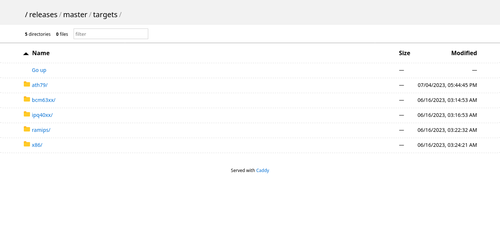
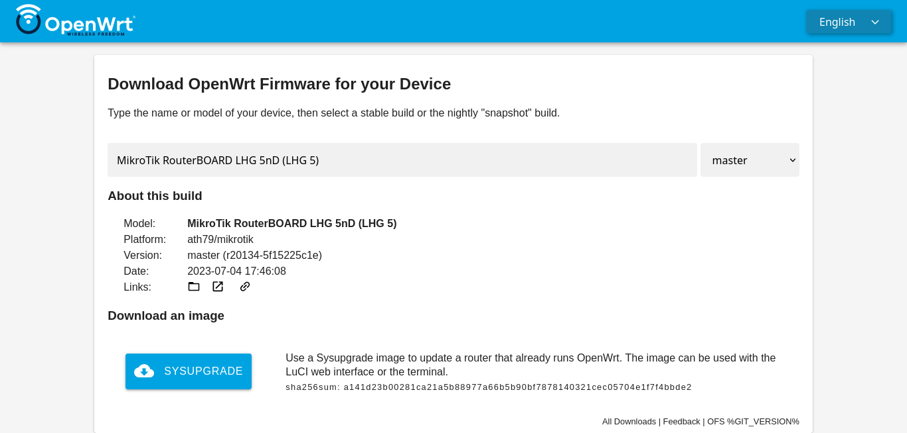

# LibreMesh Ansible playbooks

This project defines some ansible playbook templates to use [Libremesh Ansible collection](https://gitlab.com/a-gave/libremesh-ansible-collection.git) in order to build defaults or customized firmware images for LibreMesh, and to setup a monitoring system e.g. on a Raspberry Pi or a on Debian server, to simplify debugging operations and thus better plan interventions.

They are intended to automate network administration tasks and simplify cooperation on the same network by members of a LibreMesh-based community-network group of technicians.

[[_TOC_]]


Requirements
------------

Install Ansible requirements:

```
apt install ansible python3-pip
pip3 install jinja2-ansible-filters
```

To use the ansible commands `ansible-playbook`, `ansible-galaxy`
Add the `~/.local/bin` path to your .bashrc or .bash_profile

```
echo "export PATH=$PATH:$HOME/.local/bin" >> ~/.bashrc
source ~/.bashrc
```

Clone this project
```
git clone https://gitlab.com/a-gave/libremesh-ansible-playbooks.git
cd libremesh-ansible-playbooks
```

Dependencies
------------
Install roles and collections on which this collection depends

    ansible-galaxy install -r requirements.yml


Quick start Build LibreMesh firmwares
------------

#### Manually install role's requirements
By default as defined in `host_vars/localhost.yml` all requirements installations are declined for `localhost` that is the selected host for the example playbook.
You can define a root password for the builder machine via `community.general.passwordstore lookup` or `ansible-vault` or install manually the role related requirements.

For example to run the example playbook `build_libremesh` that use the openwrt imagebuilder docker based, install docker:
```
apt install docker.io
newgrp docker; usermod -aG docker $USER
systemctl daemon-reload
```

Ensure docker is working running
```
docker ps
```

#### Run the example playbook
Copy the default files and run the example playbook
```
cp hosts.example hosts
cp ansible.cfg.example ansible.cfg
ansible-playbook build_libremesh.yml
```

Overview
------------

### Build LibreMesh firmwares

Create a file called recipe to define common configurations for different devices.
The recipe file by default should be included in a path defined by the version of libremesh and by the version of openwrt that should be used, this eases and rends explicit the matching of configurations that should be applied, and is suitable e.g. for a small tech team that needs to build firmware images for different devices with configurations that may vary depending on LibreMesh or OpenWrt development.

Use the recipe to define:
- list of target_subtarget/devices of which build a firmware image 
- packages that are common to multiple devices, and to multiple target_subtarget 
- packages that depends on target_subtarget or device
- configuration files (`lime-macaddress`) and/or packages for specific devices
- environment variables about where to execute the build, where binaries should be produced, etc.

Read more at [docs/recipes.md](docs/recipes.md) for the full list of configurations for a recipe.


### Generate configurations specific for single devices
Initialize a device as an `host` in an ansible inventory file under the group `libremesh_devices` providing 
- the **macaddress** for the ansible variable `<inventory_hostname>` 
- an **hostname** for the `<inventory_hostname>.<hostname>` variables (or define a template for the hostname generation). 

The initialization generate a variables file specific to the `host` file in `host_vars/<inventory_hostname>.yml`.
You can then edit this file adding customizations.
This will be used:
- to generate a `lime-macaddress` file to include in the libremesh firmware
- during the generation of lists of `hosts` to be targeted by a monitoring system based on prometheus.

Read more about the example playbook `manage_lime_mac.yml` at [docs/manage_lime_mac.md](docs/manage_lime_mac.md)


### Setup a monitoring system
- Setup a monitoring system, e.g. on a Raspberry Pi or on a Debian server, installing:
    - prometheus
    - alertmanager
    - blackbox_exporter
    - grafana
- Setup a monitoring system with a vpn (**requires at least one device with a public ip address**)
- Add LibreMesh devices to a monitoring system


Build LibreMesh firmware images
------------

### Get started

#### 1. Create an inventory file
https://docs.ansible.com/ansible/latest/inventory_guide/intro_inventory.html

    cp hosts.example hosts

Adjust the inventory file defining:
  - hostname: here is `buildhost`
  - ip_address: here is `12.34.56.78`
  - user for ssh connection: here is `builder` 

```
# hosts.example
buildhost:
  ansible_host: 12.34.56.78
  ansible_user: builder
  ansible_become_pass: "{{ builder_become_pass }}"
  ansible_become_user: root
  ansible_become_method: su
  ansible_become_flags:
```

#### 2. Setup a system to retrieve passwords
------------

##### 2.1 using ansible-vault
https://docs.ansible.com/ansible/latest/cli/ansible-vault.html

Create a vault password

    echo 'CHANGEME' > .vault  

Create a vault protected file,
For simplicity create the variable in `group_vars/all.yml` to be sure to include it whatever host will run the playbook

    ansible-vault create group_vars/all.yml --vault-password-file=".vault"
    
Add `buildhost` root password

    builder_become_pass: ROOT_PASSWORD

##### 2.2 using community.general.passwordstore lookup
https://docs.ansible.com/ansible/latest/collections/community/general/passwordstore_lookup.html

For simplicity create the variable in `group_vars/all.yml` to be sure to include it whatever host will run the playbook

    mkdir group_vars/

Add the path to find the key in your passwordstore, in this example is `buildhost/user/root`

    cat << EOF >> group_vars/all.yml
    
    builder_become_pass: "{{ lookup('passwordstore', 'buildhost/user/root', errors='strict') | default(omit) }}"
    EOF

#### 3. Setup the ansible local configuration file
https://docs.ansible.com/ansible/latest/reference_appendices/config.html

Copy the default ansible configuration file

    cp ansible.cfg.example ansible.cfg

Adjust ansible local configuration file uncommenting `vault_password_file` if you intend to use ansible-vault
```
# ansible.cfg.example
[passwordstore_lookup]
lock = readwrite
locktimeout = 45000s

[defaults]
inventory = ./hosts
#callbacks_enabled = profile_tasks
interpreter_python = /usr/bin/python3
remote_user = root
# vault_password_file = ./.vault

[ssh_connection]
scp_if_ssh = True
```

#### 4. Setup the example playbook
Select devices of which to build a libremesh firmware image, in the playbook file `build_libremesh.yml`. In this example the selected device is `ubnt_nanostation-m-xw`.

```
---
- name: Build LibreMesh {{ libremesh_version }}
  hosts: localhost
  gather_facts: no
  vars:
    libremesh_version: master
    openwrt_version: 22.03.5
    libremesh_community: libremesh
    libremesh_community_recipe: stable
    openwrt_targets:
      - openwrt_target: ath79
        openwrt_subtarget: generic
        openwrt_devices: 
          - name: ubnt_nanostation-m-xw    
  roles: 
    - libremesh.libremesh.openwrt_imagebuilder_docker   
```

This select a default recipe located at `community/libremesh_master/openwrt_22.03.5/libremesh/stable.yml` that include the default set of packages for libremesh using the network profiles https://github.com/libremesh/network-profiles.git

Read also [docs/recipes.md](docs/recipes.md) for an explanation of the configurations files.


#### 5. Build LibreMesh

    ansible-playbook build_libremesh.yml

Read also [docs/roles_workflow.md](./roles_workflow.md) for an explanation of the build workflow.


Demo instance for firmwares
------------
A demonstrative webserver for LibreMesh firmwares is available at

http://firmware-libremesh.antennine.campiinrete.org/

Based on the recipe `libremesh/stable.yml` that basically:
- deselect problematic packages and configs for: libremesh/openwrt version, target/subtarget, specific devices
- add the default lime-community file selecting the network profile package `profile-libremesh-default` and add the suggested packages via the network profile package `profile-libremesh-suggested-packages`. These are availables via source at https://github.com/libremesh/network-profiles/tree/master/libremesh and via pre-compiled packages https://github.com/libremesh/lime-feed/tree/gh-pages/profiles (https://feed.libremesh.org/profiles)

Executed for
- `libremesh-master` based on `openwrt-22.03.5`
- `libremesh-2020.3` based on `openwrt-19.07.10`



The corresponding demo LibreMesh firmware selector is available at:

https://firmware-libremesh.antennine.campiinrete.org/selector




The same, but with the profiles of the community `valsamoggia.ninux.org` selected

https://firmware-valsamoggia.antennine.campiinrete.org/


